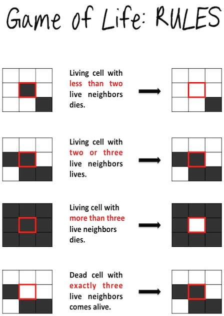

# Game of life Kata
Ejemplo de TDD con la kata Game of life en **typescript**

## Enunciado.

El juego de la vida es un autómata celular diseñado por el matemático británico John Horton Conway en 1970.

Hizo su primera aparición pública en el número de octubre de 1970 de la revista Scientific American, en la columna de juegos matemáticos de Martin Gardner. Desde un punto de vista teórico, es interesante porque es equivalente a una máquina universal de Turing, es decir, todo lo que se puede computar algorítmicamente se puede computar en el juego de la vida.

Desde su publicación, ha atraído mucho interés debido a la gran variabilidad de la evolución de los patrones. Se considera que la vida es un buen ejemplo de emergencia y autoorganización. Es interesante para los científicos, matemáticos, economistas y otros observar cómo patrones complejos pueden provenir de la implementación de reglas muy sencillas.

El juego de la vida es en realidad un juego de cero jugadores, lo que quiere decir que su evolución está determinada por el estado inicial y no necesita ninguna entrada de datos posterior. El "tablero de juego" es una malla formada por cuadrados ("células") que se extiende por el infinito en todas las direcciones. Cada célula tiene 8 células vecinas, que son las que están próximas a ella, incluidas las diagonales. Las células tienen dos estados: están "vivas" o "muertas" (o "encendidas" y "apagadas"). El estado de la malla evoluciona a lo largo de unidades de tiempo discretas (se podría decir que por turnos). El estado de todas las células se tiene en cuenta para calcular el estado de las mismas al turno siguiente. Todas las células se actualizan simultáneamente.

Las transiciones dependen del número de células vecinas vivas:

- Una célula muerta con exactamente 3 células vecinas vivas "nace" (al turno siguiente estará viva).

- Una célula viva con 2 ó 3 células vecinas vivas sigue viva, en otro caso muere o permanece muerta (por "soledad" o "superpoblación").




## Instalación.
```
typescript    https://www.typescriptlang.org/
Jest Runner   https://marketplace.visualstudio.com/items?itemName=firsttris.vscode-jest-runner
vscode-icons  https://marketplace.visualstudio.com/items?itemName=vscode-icons-team.vscode-icons
ts-jest       https://github.com/kulshekhar/ts-jest 
```

## Línea de comandos.
```
npm install --save-dev jest
npm i @types/jest

Prerequisites       npm i -D jest typescript	
Installing          npm i -D ts-jest @types/jest	
Creating config     npx ts-jest config:init	
Running tests	    npx jest	
```
